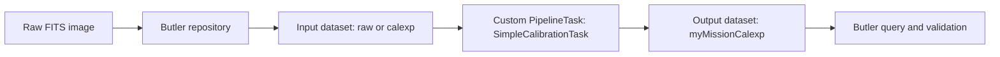
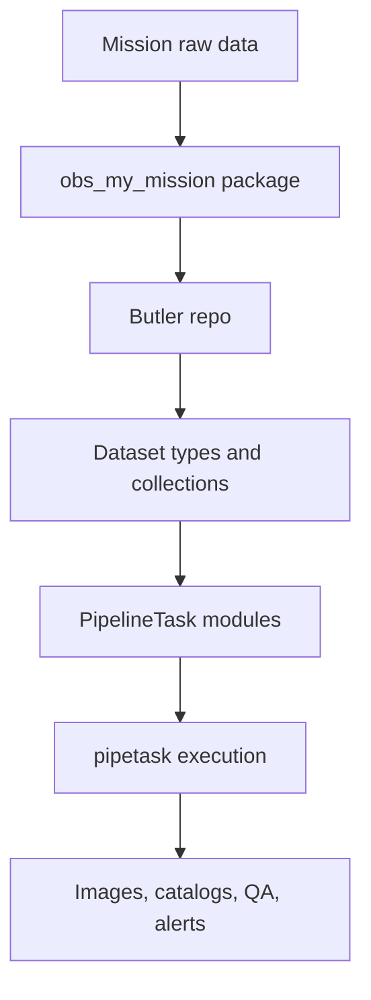
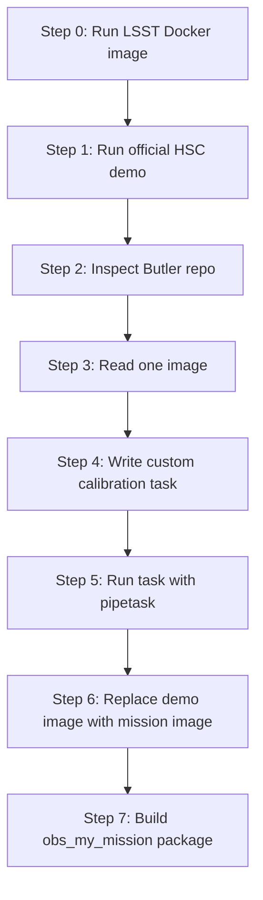
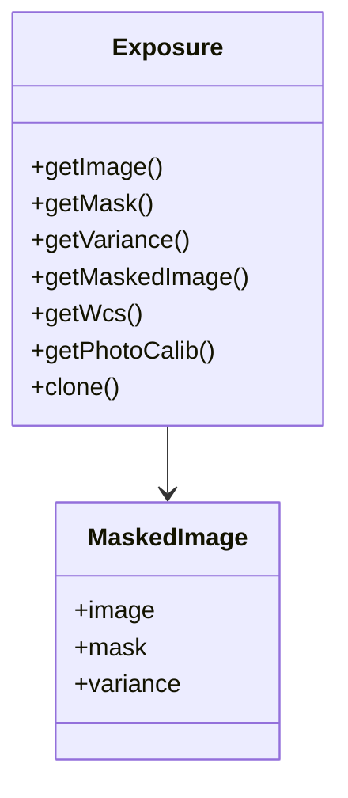
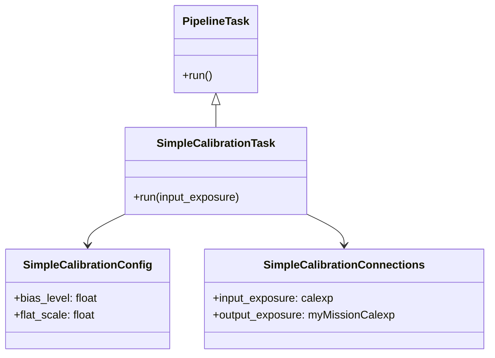
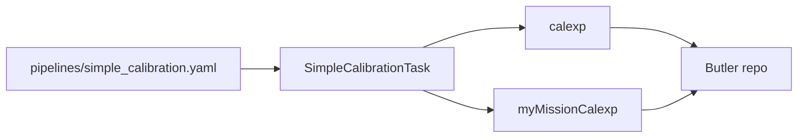
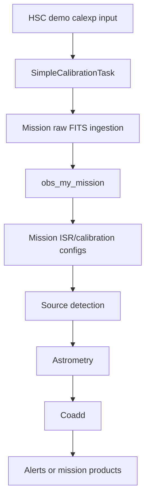

# Reusing the LSST/Rubin Framework for a Different Mission: A Hands-On Developer Guide

This guide is for Python-capable developers who are new to Rubin/LSST Pipelines and want to start coding quickly with a minimal, working, LSST-style flow.

> **What you will build**
>
> A working mini pipeline that goes from demo image data to a custom `PipelineTask` output and Butler query.

---

## 1. What you are building

You will build this minimal LSST-style mission pipeline:

```text
Synthetic raw FITS
  → ingest into Butler-like or real Butler repo
  → read an Exposure-like image
  → run a custom calibration task
  → write calibrated output
  → query the result
```



| Tutorial layer    | What it teaches                                |
| ----------------- | ---------------------------------------------- |
| Docker            | Reproducible LSST environment on macOS         |
| Butler            | Dataset identity, collections, and retrieval   |
| Image layer       | Exposure-like image handling                   |
| PipelineTask      | Reusable algorithm packaging                   |
| Pipeline YAML     | Connecting tasks into a runnable workflow      |
| Mission extension | How to move from demo to real `obs_my_mission` |

> **Why this matters**
>
> You can start with known-good Rubin demo data and immediately prototype mission logic before full instrument integration.

---

## 2. The LSST/Rubin mental model in five minutes



Layer summary:
- **obs package**: mission/instrument translation layer.
- **Butler**: data registry + datastore abstraction for datasets and data IDs ([Butler docs](https://pipelines.lsst.io/modules/lsst.daf.butler/index.html)).
- **Dataset types + collections**: product names and processing/version groupings.
- **PipelineTask + YAML**: algorithm unit plus declarative wiring ([PipelineTask docs](https://pipelines.lsst.io/modules/lsst.pipe.base/index.html)).
- **pipetask**: execution engine over Butler datasets ([pipetask docs](https://pipelines.lsst.io/modules/lsst.ctrl.mpexec/index.html)).

| Rubin/LSST term | Developer mental model                                |
| --------------- | ----------------------------------------------------- |
| Butler          | Dataset registry + object store abstraction           |
| Dataset type    | Logical product name, such as `raw`, `calexp`, `src` |
| Collection      | Named grouping/version of datasets                    |
| Data ID         | Structured primary key for a dataset                  |
| PipelineTask    | Reusable processing unit                              |
| Pipeline YAML   | Declarative wiring for task graph                     |
| obs package     | Instrument adapter layer                              |

---

## 3. Recommended onboarding path



For each step in this tutorial, you get:
- Goal
- Command/code
- Expected output
- Common failure
- Checkpoint

---

## 4. Environment setup for macOS Apple Silicon

> **Goal**
>
> Start a reproducible Rubin environment in Docker.

```bash
mkdir -p ~/work/lsst-mission-tutorial
cd ~/work/lsst-mission-tutorial

docker run -it \
  --platform linux/amd64 \
  -v "$PWD":/home/lsst/mnt \
  lsstsqre/centos:7-stack-lsst_distrib-v29_2_1
```

Inside container:

```bash
source /opt/lsst/software/stack/loadLSST.bash
setup lsst_distrib
eups list lsst_distrib
```

`--platform linux/amd64` is often needed on Apple Silicon because many published Rubin stack images target x86_64 ([Rubin Docker install docs](https://pipelines.lsst.io/install/docker.html)).

> **Troubleshooting**
>
> If Docker is slow on Apple Silicon, that is expected under amd64 emulation. For tutorial work this is acceptable. For sustained development, prefer Linux x86_64 VM or remote host.

**Checkpoint**: `eups list lsst_distrib` shows installed distribution.

---

## 5. First known-good run: official HSC demo

> **Why this matters**
>
> Proves your stack, Butler, and execution flow work before mission customization ([demo guide](https://pipelines.lsst.io/getting-started/index.html)).

```bash
mkdir -p /home/lsst/mnt/demo
cd /home/lsst/mnt/demo

curl -L https://github.com/lsst/pipelines_check/archive/29.2.1.tar.gz | tar xvzf -
cd pipelines_check-29.2.1

setup -r .
./bin/run_demo.sh
```

Creates:

```text
DATA_REPO/
demo_collection
raw datasets
calexp datasets
source/catalog-like outputs (depending on demo configuration)
```

Checkpoint:

```bash
butler query-collections DATA_REPO
butler query-datasets DATA_REPO calexp --collections demo_collection
```

---

## 6. Inspect Butler from Python

File: `src/inspect_repo.py`

```python
from lsst.daf.butler import Butler


def main() -> None:
    repo = "DATA_REPO"
    collection = "demo_collection"

    butler = Butler(repo)

    print("Collections:")
    for name in butler.registry.queryCollections():
        print(f"  - {name}")

    print("\nDataset types:")
    for dataset_type in butler.registry.queryDatasetTypes():
        print(f"  - {dataset_type.name}")

    print("\ncalexp datasets:")
    refs = list(
        butler.registry.queryDatasets(
            "calexp",
            collections=collection,
        )
    )

    for ref in refs:
        print(f"  - dataId={dict(ref.dataId)} run={ref.run}")

    print(f"\nFound {len(refs)} calexp dataset(s).")


if __name__ == "__main__":
    main()
```

**Checkpoint**:

```bash
python src/inspect_repo.py
```

Expected: at least one `calexp` dataset.

---

## 7. Read one image and compute statistics

File: `src/read_image_stats.py`

```python
import numpy as np
from lsst.daf.butler import Butler


def main() -> None:
    butler = Butler("DATA_REPO")

    refs = list(
        butler.registry.queryDatasets(
            "calexp",
            collections="demo_collection",
        )
    )

    if not refs:
        raise RuntimeError("No calexp datasets found in demo_collection.")

    ref = refs[0]
    exposure = butler.get(ref)

    image = exposure.getImage().array

    print("Data ID:", dict(ref.dataId))
    print("Image shape:", image.shape)
    print("Mean:", float(np.nanmean(image)))
    print("Std:", float(np.nanstd(image)))
    print("Min:", float(np.nanmin(image)))
    print("Max:", float(np.nanmax(image)))


if __name__ == "__main__":
    main()
```

Exposure model:

```text
Exposure
  ├── image plane
  ├── mask plane
  ├── variance plane
  ├── WCS
  ├── PSF
  └── photometric calibration
```



Checkpoint:

```bash
python src/read_image_stats.py
```

---

## 8. Build a simple mission calibration task

Mission starter algorithm:

```text
output = (input - bias_level) / flat_scale
```

Pattern to learn:

```text
Butler input dataset
  → PipelineTask
  → task config
  → Butler output dataset
```



File: `python/lsst/my_mission/tasks/simple_calibration.py`

```python
import lsst.pex.config as pexConfig
import lsst.pipe.base as pipeBase
import lsst.pipe.base.connectionTypes as cT


class SimpleCalibrationConnections(
    pipeBase.PipelineTaskConnections,
    dimensions=("instrument", "visit", "detector"),
):
    input_exposure = cT.Input(
        name="calexp",
        doc="Input calibrated exposure used as a stand-in for a mission image.",
        storageClass="ExposureF",
        dimensions=("instrument", "visit", "detector"),
    )

    output_exposure = cT.Output(
        name="myMissionCalexp",
        doc="Mission-specific calibrated exposure produced by the tutorial task.",
        storageClass="ExposureF",
        dimensions=("instrument", "visit", "detector"),
    )


class SimpleCalibrationConfig(
    pipeBase.PipelineTaskConfig,
    pipelineConnections=SimpleCalibrationConnections,
):
    bias_level = pexConfig.Field(
        dtype=float,
        default=0.0,
        doc="Scalar bias level to subtract from image pixels.",
    )

    flat_scale = pexConfig.Field(
        dtype=float,
        default=1.0,
        doc="Scalar flat-field scale to divide image pixels by.",
    )


class SimpleCalibrationTask(pipeBase.PipelineTask):
    """Minimal mission-specific calibration driver.

    This task demonstrates the LSST/Rubin extension pattern:
    read an ExposureF from Butler, apply configurable mission logic,
    and write a new ExposureF dataset.
    """

    ConfigClass = SimpleCalibrationConfig
    _DefaultName = "simpleCalibration"

    def run(self, input_exposure):
        if self.config.flat_scale == 0.0:
            raise ValueError("flat_scale must be non-zero")

        output = input_exposure.clone()
        masked_image = output.getMaskedImage()

        masked_image -= self.config.bias_level
        masked_image /= self.config.flat_scale

        return pipeBase.Struct(output_exposure=output)
```

---

## 9. Add pipeline YAML

File: `pipelines/simple_calibration.yaml`

```yaml
description: "Tutorial pipeline: mission-specific simple calibration."

tasks:
  simpleCalibration:
    class: lsst.my_mission.tasks.simple_calibration.SimpleCalibrationTask
    config:
      bias_level: 10.0
      flat_scale: 1.02
```



---

## 10. Run the custom task

```bash
export PYTHONPATH="$PWD/python:$PYTHONPATH"

pipetask run \
  -b DATA_REPO \
  -i demo_collection \
  -o my_mission/run1 \
  -p pipelines/simple_calibration.yaml \
  -d "instrument='HSC'"
```

If needed, narrow dimensions after inspecting available data IDs with Butler CLI queries.

File: `src/validate_custom_output.py`

```python
from lsst.daf.butler import Butler


def main() -> None:
    butler = Butler("DATA_REPO")

    refs = list(
        butler.registry.queryDatasets(
            "myMissionCalexp",
            collections="my_mission/run1",
        )
    )

    print(f"Found {len(refs)} myMissionCalexp dataset(s).")

    for ref in refs:
        exposure = butler.get(ref)
        image_shape = exposure.getImage().array.shape
        print("Data ID:", dict(ref.dataId))
        print("Image shape:", image_shape)


if __name__ == "__main__":
    main()
```

Checkpoint:

```bash
python src/validate_custom_output.py
```

---

## 11. Convert the tutorial into a simple repo layout

```text
lsst-mission-tutorial/
├── README.md
├── pipelines/
│   └── simple_calibration.yaml
├── python/
│   └── lsst/
│       └── my_mission/
│           ├── __init__.py
│           └── tasks/
│               ├── __init__.py
│               └── simple_calibration.py
├── src/
│   ├── inspect_repo.py
│   ├── read_image_stats.py
│   └── validate_custom_output.py
├── scripts/
│   ├── enter_container.sh
│   ├── run_hsc_demo.sh
│   └── run_simple_calibration.sh
└── Makefile
```

Use:

```bash
make shell
make demo
make inspect
make stats
make run-task
make validate
```

---

## 12. Show how this becomes a real mission integration



| Tutorial part           | Production replacement                      |
| ----------------------- | ------------------------------------------- |
| HSC demo `calexp`       | Mission `raw` or `postISRCCD`               |
| Scalar bias subtraction | Full ISR/calibration model                  |
| Scalar flat scale       | Flat-field calibration dataset              |
| Simple output dataset   | Mission-defined calibrated image product    |
| Demo collection         | Versioned mission processing collection     |
| No obs package          | `obs_my_mission`                            |
| Single image            | Visit/detector-scale processing             |
| Local repo              | Shared Butler repo on POSIX/S3/object store |

---

## 13. What to inspect when adapting to a mission

### FITS headers
Identify:

```text
INSTRUME
DETECTOR
EXPID
VISIT
FILTER
DATE-OBS
EXPTIME
RA
DEC
WCS keywords
GAIN
RDNOISE
SATURATE
```

### Detector model
Ask:

```text
How many detectors?
How many amplifiers?
Is overscan present?
Is the detector orientation known?
Is there a bad-pixel mask?
```

### Calibration model
Ask:

```text
Are bias, dark, flat, linearity, crosstalk, fringe, and defects available?
Are they time-dependent?
Are they detector-dependent?
Are they filter-dependent?
```

### Data ID model
Ask:

```text
What uniquely identifies one processable image?
instrument + exposure + detector?
instrument + visit + detector?
something else?
```

---

## 14. Common failure modes

| Symptom                                | Likely cause                                | Fix                                          |
| -------------------------------------- | ------------------------------------------- | -------------------------------------------- |
| `ModuleNotFoundError: lsst.my_mission` | `PYTHONPATH` not set                        | Export `PYTHONPATH=$PWD/python:$PYTHONPATH`  |
| No `calexp` datasets found             | Demo did not run or wrong collection        | Run demo and query collections               |
| `pipetask` cannot resolve dimensions   | Data query too broad or wrong dimensions    | Inspect `query-datasets` output              |
| Output dataset not found               | Task did not run or output collection wrong | Check `-o` collection and task logs          |
| Docker slow on Mac                     | amd64 emulation on Apple Silicon            | Accept for tutorial or use x86_64 Linux host |

---

## 15. References

These are cited inline above and collected here:

1. Rubin Science Pipelines Docker install: https://pipelines.lsst.io/install/docker.html
2. Rubin getting started and demos (including HSC examples): https://pipelines.lsst.io/getting-started/index.html
3. Butler documentation (`lsst.daf.butler`): https://pipelines.lsst.io/modules/lsst.daf.butler/index.html
4. `lsst.pipe.base` / `PipelineTask`: https://pipelines.lsst.io/modules/lsst.pipe.base/index.html
5. `lsst.ctrl.mpexec` / `pipetask`: https://pipelines.lsst.io/modules/lsst.ctrl.mpexec/index.html
6. Rubin Data Butler paper (Jenness et al.): https://ui.adsabs.harvard.edu/abs/2022SPIE12189E..11J/abstract
7. Hyper-Suprime-Cam pipeline and LSST software reuse context: https://arxiv.org/abs/1705.00067

---

## 16. Final quality bar

After completing this tutorial, you should be able to:

1. Start Docker on macOS Apple Silicon
2. Run the official HSC demo
3. Inspect a Butler repository
4. Read one LSST image dataset
5. Create a custom `PipelineTask`
6. Configure it with pipeline YAML
7. Run it with `pipetask`
8. Query the output dataset
9. Map the demo to real mission integration
10. Define next build steps: `obs_my_mission`, raw translator, calibrations, source extraction, astrometry, coadds, QA, alerts

> **Where to go next**
>
> Start replacing the demo assumptions with mission mocks (headers, data IDs, calibrations), then package those choices into `obs_my_mission`.
